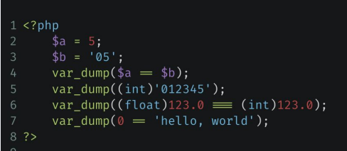

# Основы PHP #

## Урок 1. Введение в PHP ##
#

**Домашнее задание 1.**

1. Собрать для себя окружение из Nginx + PHP-FPM и PHP CLI.
2. Выполните код в контейнере PHP CLI и объясните, что выведет данный код и почему:

3. В контейнере с PHP CLI поменяйте версию PHP с 8.2 на 7.4. Изменится ли вывод?
4. Используя только две числовые переменные, поменяйте их значение местами. Например, если a = 1, b = 2, надо, чтобы получилось: b = 1, a = 2. 
Дополнительные переменные, функции и конструкции типа list() использовать нельзя.

#
## Урок 2. Условия, Массивы, циклы, функции. ##
#
**Домашнее задание 2.**

1. Реализовать основные 4 арифметические операции в виде функции с тремя параметрами – два параметра это числа, третий – операция. Обязательно использовать оператор return.

2. Реализовать функцию с тремя параметрами: function mathOperation($arg1, $arg2, $operation), где $arg1, $arg2 – значения аргументов, $operation – строка с названием операции. В зависимости от переданного значения операции выполнить одну из арифметических операций (использовать функции из пункта 3) и вернуть полученное значение (использовать switch).

3. Объявить массив, в котором в качестве ключей будут использоваться названия областей, а в качестве значений – массивы с названиями городов из соответствующей области. Вывести в цикле значения массива, чтобы результат был таким: Московская область: Москва, Зеленоград, Клин Ленинградская область: Санкт-Петербург, Всеволожск, Павловск, Кронштадт Рязанская область … (названия городов можно найти на maps.yandex.ru).

4. Объявить массив, индексами которого являются буквы русского языка, а значениями – соответствующие латинские буквосочетания (‘а’=> ’a’, ‘б’ => ‘b’, ‘в’ => ‘v’, ‘г’ => ‘g’, …, ‘э’ => ‘e’, ‘ю’ => ‘yu’, ‘я’ => ‘ya’). Написать функцию транслитерации строк.

5. *С помощью рекурсии организовать функцию возведения числа в степень. Формат: function power($val, $pow), где $val – заданное число, $pow – степень.

6. *Написать функцию, которая вычисляет текущее время и возвращает его в формате с правильными склонениями, например:
22 часа 15 минут
21 час 43 минуты.
#
## Урок 3. Файлы, подключение кода, Composer. ##
#
**Домашнее задание 3.**

1. Обработка ошибок. Посмотрите на реализацию функции в файле fwrite-cli.php в исходниках. Может ли пользователь ввести некорректную информацию (например, дату в виде 12-50-1548)? Какие еще некорректные данные могут быть введены? Исправьте это, добавив соответствующие обработки ошибок.

2. Поиск по файлу. Когда мы научились сохранять в файле данные, нам может быть интересно не только чтение, но и поиск по нему. Например, нам надо проверить, кого нужно поздравить сегодня с днем рождения среди пользователей, хранящихся в формате:

Василий Васильев, 05-06-1992

И здесь нам на помощь снова приходят циклы. Понадобится цикл, который будет построчно читать файл и искать совпадения в дате. Для обработки строки пригодится функция explode, а для получения текущей даты – date.

3. Удаление строки. Когда мы научились искать, надо научиться удалять конкретную строку. Запросите у пользователя имя или дату для удаляемой строки. После ввода либо удалите строку, оповестив пользователя, либо сообщите о том, что строка не найдена.

4. Добавьте новые функции в итоговое приложение работы с файловым хранилищем.

#
## Урок 4. ООП. ##
#
**Домашнее задание 4.**

1. Придумайте класс, который описывает любую сущность из предметной области библиотеки: книга, шкаф, комната и т.п.

2. Опишите свойства классов из п.1 (состояние).

3. Опишите поведение классов из п.1 (методы).

4. Придумайте наследников классов из п.1. Чем они будут отличаться?

5. Создайте структуру классов ведения книжной номенклатуры.
— Есть абстрактная книга.
— Есть цифровая книга, бумажная книга.
— У каждой книги есть метод получения на руки.

У цифровой книги надо вернуть ссылку на скачивание, а у физической – адрес библиотеки, где ее можно получить. У всех книг формируется в конечном итоге статистика по кол-ву прочтений.
Что можно вынести в абстрактный класс, а что надо унаследовать?

6. Дан код:

class A {
public function foo() {
static $x = 0;
echo ++$x;
}
}
$a1 = new A();
$a2 = new A();
$a1->foo();
$a2->foo();
$a1->foo();
$a2->foo();

Что он выведет на каждом шаге? Почему?

Немного изменим п.5

class A {
public function foo() {
static $x = 0;
echo ++$x;
}
}
class B extends A {
}
$a1 = new A();
$b1 = new B();
$a1->foo();
$b1->foo();
$a1->foo();
$b1->foo();

Что он выведет теперь?
#
## Урок 5. Разработка каркаса приложения. ##
#

**Домашнее задание 5.**

1. Добавьте к шаблону подключение файлов стилей так, чтобы в дальнейшем можно было дорабатывать внешний вид системы.

2. Сформируйте еще три подключаемых к скелету блока – шапку сайта (она всегда будет одинаковой по стилю и располагаться в самой верхней части), подвал сайта (также одинаковый, но в нижней части) и sidebar (боковая колонка, которую можно наполнять новыми элементами).

3. Средствами TWIG выводите на экран текущее время.

4. Создайте обработку страницы ошибки. Например, если контроллер на найден, то нужно вызывать специальный метод рендеринга, который сформирует специальную страницу ошибок.

5. Для страницы ошибок формируйте HTTP-ответ 404. Это можно сделать при помощи функции header.

6. Реализуйте функционал сохранения пользователя в хранилище. Сохранение будет происходить при помощи GET-запроса.

/user/save/?name=Иван&birthday=05-05-1991
#
## Урок 6. Работа с БД. ##
#

**Домашнее задание 6.**

Мы стали работать с исключениями. 
1. Создайте в Render логику обработки исключений так, чтобы она встраивалась в общий шаблон. Вызов будет выглядеть примерно так:

try{
$app = new Application();
echo $app->run();
}
catch(Exception $e){
echo Render::renderExceptionPage($e);
}

2. Создайте метод обновления пользователя новыми данными. Например,

/user/update/?id=42&name=Петр

Такой вызов обновит имя у пользователя с ID 42. Обратите внимание, что остальные поля не меняются. Также помните, что пользователя с ID 42 может и не быть в базе.

3. Создайте метод удаления пользователя из базы. Учитывайте, что пользователя может не быть в базе.

/user/delete/?id=42

#
## Урок 7. Пишем личный кабинет и хранилище файлов. ##
#

**Домашнее задание 7.**

1. При помощи регулярных выражений усильте проверку данных в validateRequestData так, чтобы пользователь не смог передать на обработку любую строку, содержащую HTML-теги(например, script)

2. Доработайте шаблон аутентификации. В нем нужно добавить две вещи:

В приветствии нужно выводить имя залогинившегося пользователя.
Также надо выводить ссылку «Выйти из системы», которая будет уничтожать сессию пользователя.

3. Переработайте имеющийся функционал приложения на формы.

Создание, обновление и удаление пользователя теперь должно производиться через формы.
Если пользователь обновляется, в форму должны быть выведены текущие значения. Это может быть сделано ссылкой из списка пользователей (рядом с каждым из них будет своя ссылка “Обновить данные”).

4. *Создайте функцию “Запомнить меня” в форме логина.

В форме должен появиться checkbox “Запомнить меня”.
При нажатии на него в процессе логина пользователю выдаётся cookie, по которому происходит автоматическая авторизация, даже если сессия закончилась.
При логине нужно будет генерировать токен из random_bytes(), размещая его в cookies и БД, чтобы сравнивать их
При выходе из системы токен надо деактивировать.

5. Исправьте потолстевший Абстрактный контроллер.

#
## Урок 8. Учимся собирать логи, дебажим приложение. ##
#

**Домашнее задание 8.**

В уже созданных маршрутах попробуйте вызывать их с некорректными данными. Что будет происходить? Будут ли появляться ошибки?

При появлении ошибок, произведите их анализ. Обязательно зафиксируйте шаги своих размышлений.
На основании анализа произведите устранение.